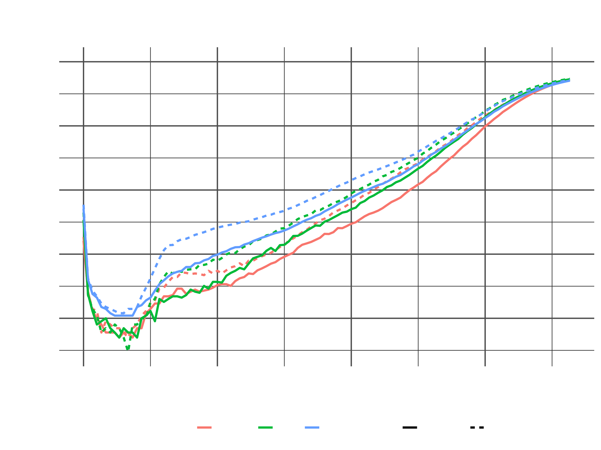
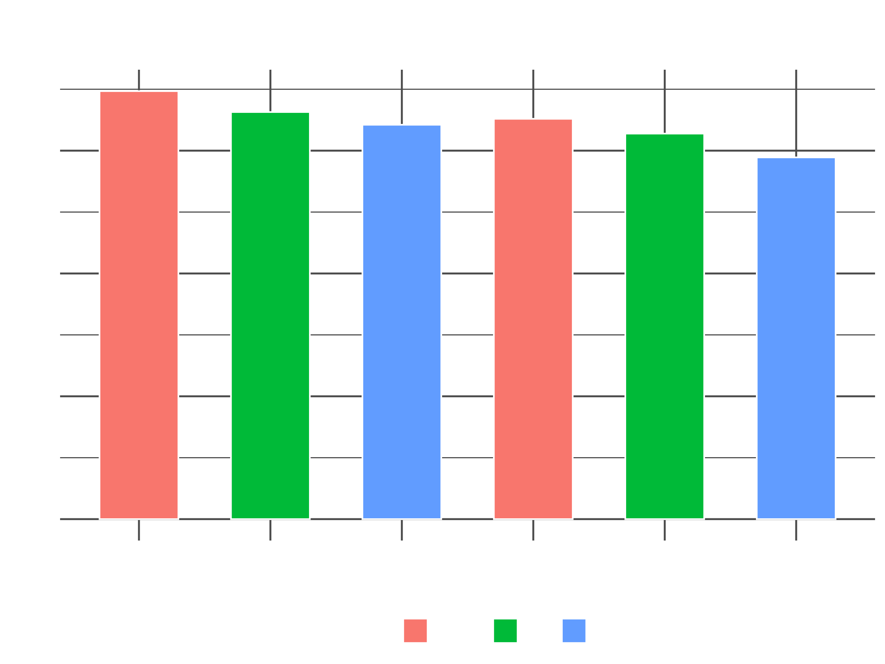

# Global Mortality Comparison (UK, US, Japan – 2022)

This quick project compares mortality patterns across Japan, the UK, and the United States using 2022 life tables from the [Human Mortality Database](https://www.mortality.org/).  
The analysis was done in R using the tidyverse, with visualizations comparing:

- Probability of death (`qₓ`) by age
- Life expectancy at birth (`e₀`) by country and gender

---

## Visual Outputs

### Probability of Death by Age (`qₓ`)
- Log-scaled line chart by country and gender  

### Life Expectancy at Birth (`e₀`)
- Clean bar chart comparing male/female across countries  

---

## What I Learned

- Reading and wrangling raw period life tables from `.txt` files
- Using tidyverse pipelines to filter, mutate, and bind large datasets
- Plotting transparent, styled charts for portfolio use

---

## Tools Used

- **Language**: R
- **Libraries**: `tidyverse`, `ggplot2`
- **Data**: HMD period life tables (2022, 1x1 format)

---

## Notes

- All data is publicly accessible and sourced from mortality.org
- Charts use a transparent background with white text for dark-site embedding. (So try dark mode if you cant see them)
- Short project designed to strengthen my R skills
---

🔗 [Visit My Website: Danny Nufer](https://dannynufer.co.uk)
